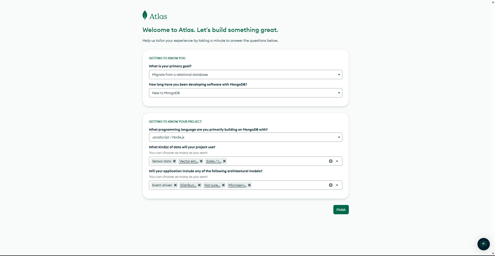
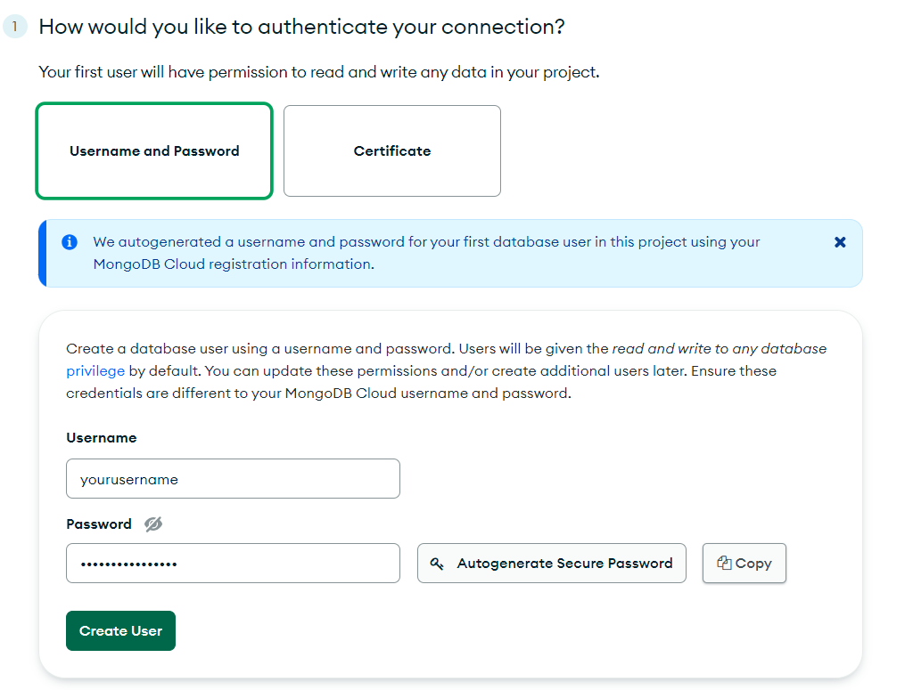
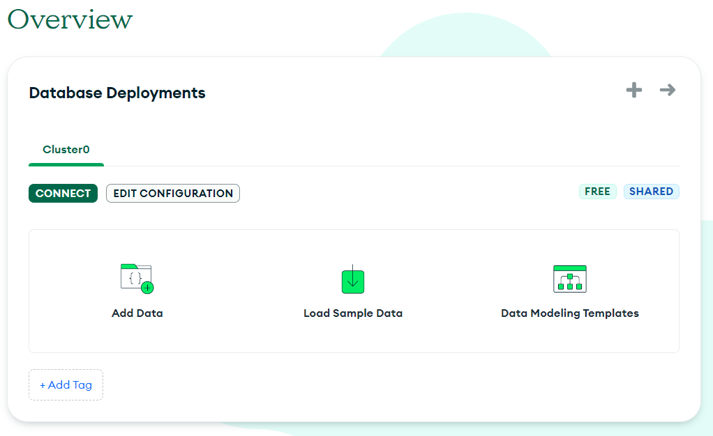
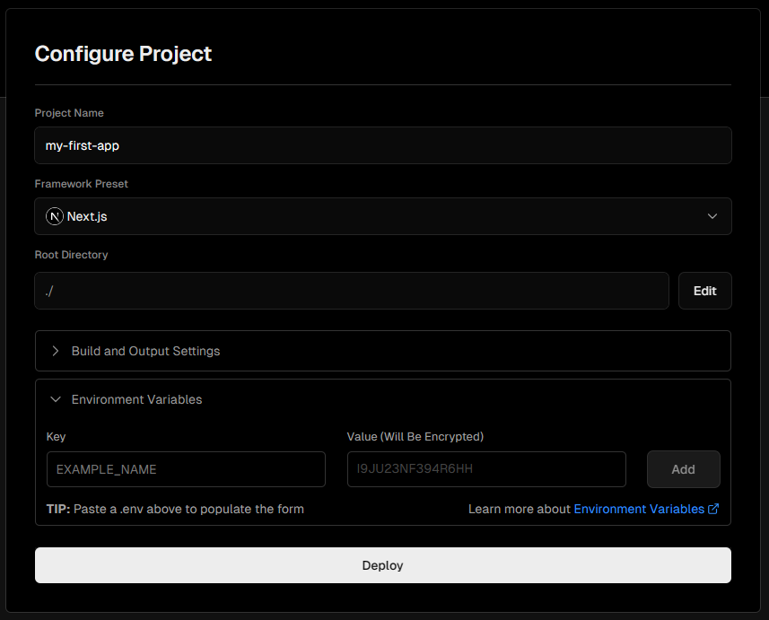

# Microsoft E5 Dev Renewal

Welcome to E5 Dev renewal, here you will learn how to auto renew your E5 dev program. Follow the steps carefully, because there are many:

## Creating A Web Application in Azure Active Directory

- Head over to [App Registration | Azure Portal](https://portal.azure.com/#view/Microsoft_AAD_RegisteredApps/ApplicationsListBlade) page where you can see all the applications registered. Here, we're going to add a new application. If you are not able to open the link, go to [Azure Portal](https://portal.azure.com) and on the top searchbar, type app registrations and click on the first item, it will look like this 

- Click on the new registration button on the app regisrtations page.

- Enter the following details, in the Redirect URI, the url is `https://e5.thecaduceus.eu.org/auth` and click Register. 

- Store the `Application (client) ID` in notepad or some other text editor for future use.

- Now go to `Certificates & Secrets` tab on the left navigation menu, and click on `+ New client secret`, give it any name and the longest expiry time i.e., `730 days`.

- Store the secret value where you stored the client ID.

## Getting the Refresh Token

- Go to this url by replacing the `YourClientID` and `YourClientSecret` with the ones just copied in previous steps: `https://e5.thecaduceus.eu.org/auth?client_id=YourClientID&client_secret=YourClientSecret`

- Follow the instrutions and at the end you will get the refersh token, store it along with the two values (client id, client secret, and refresh token).

## Creating a database in MongoDB

- Go to [MongoDB](https://www.mongodb.com/), where you will have to login with your Google or Github account, and fill with whatever details you want to in the welcome page, it doesn't really matter. 

- Click finish and you will be redirected to deploy your database page, choose the share option which is free and click Create. (You can tweek the values if you want to).

- This will take you to `Security Quickstart` page where you will create a user and password, save the credentials and click on `Create user`. 

- Below that will be the IP Address list, add a new entry with `0.0.0.0`

- Click `Finish and Close` and then click on `Go to Overview`

- Click on the `connect` button 

- Choose `MongoDB for VS Code` option and in the 3rd item copy the url for connection, it will be like this `mongodb+srv://yourusername:<password>@cluster0.mguuxui.mongodb.net/` and replace the `<password>` with the saved password in the Create user step.

- Store this MongoDB connection url along with the previous three things. Now, we have all the things to fork the repo.

  - Client ID
  - Client Secret
  - Refresh Token
  - Mongo URL

## Forking this repository

- Fork this repository in your github, by click on the Fork button on the top side of the page, below navigation tabs.

- Once you fork this repo, go to [`refresh-token.json`](/tmp/refresh-token.json) file and edit the file to replace the refresh token's value with your token and then commit changes.

## Deploying to Vercel

- Now go [Vercel](https://vercel.com) and sign in with your github account where you forked this repository.

- After signing in, you will find the `Add New` drop-down on the top-right and select `Project`.

- Click on the `Microsoft-E5-Renew` or whatever you named the forked repo from the Import page.

- Now, give your application a name and go to Environment Variables dropdown, 

- Here add three environment variables, which are as follows:
  - `CLIENT_ID` - In the value, paste the client_id you stored from Azure App Registration step
  - `CLIENT_SECRET` - Paste the secret here
  - `MONGO_URI` - Paste the mongodb connection string here.

> It is important that you write the key of these variables as they are mentioned otherwise it won't work.

- After doing this, click on the `Deploy` button. Wait for the application to be deployed.

- After it is deployed you will get a URL which you can visit to see the deployed website. Store this deployed `URL`.

## Running Cron Job

- This is the final step. Head over to [Cron-Jobs](https://cron-job.org/) and sign in.

- After signing in, click on the `CREATE CRONJOB` button.

- Give any random title you want to, and paste the `URL` you deployed your application in the Vercel step. Now add `/api/auth` to the `URL` so that the complete URL becomes: `URL/api/auth`.

- Schedule it to run the job every 1 hour or so and hit `Create`.

- The job will run from time to time and will call Microsoft's Graph APIs to ensure developer activity happening.

Its done!🎉🙌

